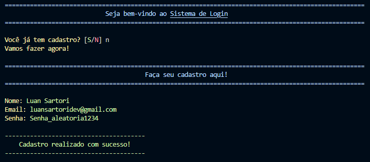
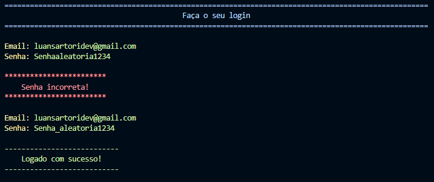
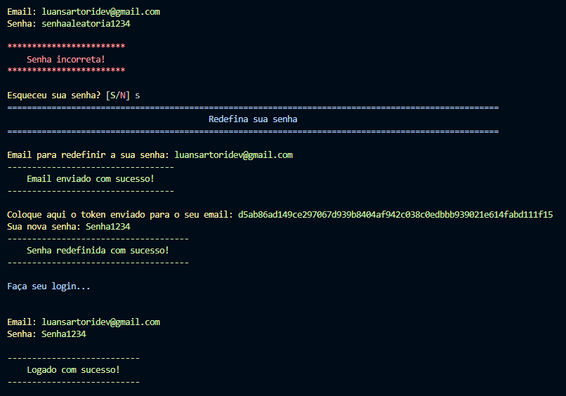
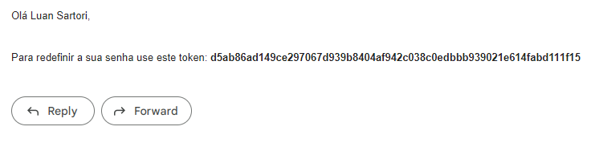

 
 <h2 align="center">Sistema de Login</h2>
 
Um sistema para cadastro/login de usuários feito com Python que roda pelo prompt de comando salvando tudo em um banco de dados SQL

## Demonstração 💻

Para iniciar basta iniciar o banco de dados e executar o arquivo `views.py`:

---

Depois de fazer um cadastro é só fazer o login:

---

Caso você erre a senha por 2 ou mais vezes o sistema irá perguntar se você não esqueceu a senha, caso você responda que sim ele irá perguntar o seu email e enviar um token único, que você deve retornar para o sistema para assim redefinir sua senha:

## Técnico

- Python 3.10.2
- Interface - Prompt de comando
- Bibliotecas: 📚

    - PyMySQL 1.0.2
    - SQLAlchemy 1.4.42
    - bcrypt 4.0.1

- Banco de dados hospedado no localhost com XAMPP 🖧

## Como usar 📝

- Instale as bibliotecas
- Crie um banco de dados pelo XAMPP ou outro software
- Dentro do arquivo `dao.py` configure a string de conexão na linha 8 a 14
- Com a string de conexão configurada e o banco de dados já ligado execute o arquivo `model.py`para carregar as tabelas no banco de dados
- Agora já está tudo pronto e só executar a views.py